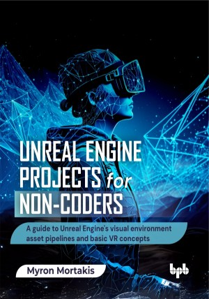

# Unreal Engine Projects for Non-coders

A guide to Unreal Engine's visual environment asset pipelines and basic VR concepts.

This is the repository for [Unreal Engine Projects for Non-coders](https://bpbonline.com/products/unreal-engine-projects-for-non-coders?variant=44649370812616), published by BPB Publications. 

The code bundles of this book are available here: https://rebrand.ly/c1m9l39

## About the Book
Unreal Engine stands as a powerful real-time 3D creation tool, renowned across industries for its stunning visuals and versatile applications. It enables the creation of immersive and interactive experiences without requiring traditional coding skills.

This book takes a practical, project-based approach. It begins with an introduction to Unreal Engine 5, offering a basic overview of its UI, tools and features, and core technologies. Each project focuses on specific areas and workflows, allowing the readers to get a basic grasp of the Unreal Engine’s basic workflows, to a complete environment, built with custom assets, featuring a mini-game. The book covers topics such as Blueprints (Unreal Engine’s node-based visual scripting), Nanite and Lumen technologies, Quixel Megascan, lighting and materials, a glimpse into the exciting world of VR development,  covering base and high-poly modeling, texturing, level design principles, and implementing character interactions.

By the end of this book, you will gain a strong practical foundation in Unreal Engine, capable of bringing your creative visions to life through compelling projects and possessing the skills to explore further into the realm of real-time 3D development.

## What You Will Learn
• Unreal Engine 5’s basic UI, tools, and workflows.

• Introduction to key UE5 tech, Nanite, and Lumen.

• Plan model base/high-poly castle assets using external 3D software expertly.

• Implement character movement and interactions using Blueprints visually and effectively.

• Develop interactive elements, UI widgets, and mini-game mechanics via Blueprints.

• Grasp VR basics within UE and apply to existing projects technically.
